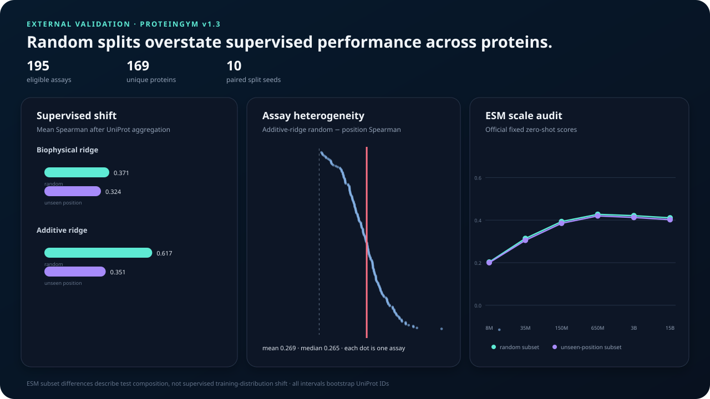
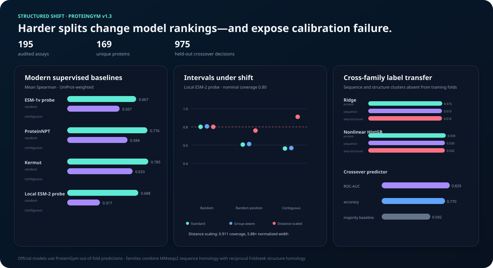

# VariantShift

**When does a protein mutation predictor actually generalize?**

VariantShift is a leakage-aware benchmark for protein variant-effect models. It compares
ordinary random splits with biologically harder tests: unseen residue positions, increased
mutational depth, and transfer between experimental conditions.

The initial case study uses the Align Foundation's TEV protease GROQ-seq release: 18,486
variants measured across 24 conditions at NIST's Living Measurement Systems Foundry.

## Research questions

1. How much does random splitting overstate performance?
2. Which models retain rank accuracy at residue positions absent from training?
3. Do single-mutant models transfer to combinatorial variants?
4. Which experimental conditions preserve variant rankings across assay shifts?
5. Is model confidence calibrated when the biological distribution shifts?
6. Does the random-versus-unseen-position gap replicate across independent proteins?
7. How do supervised baselines compare with audited zero-shot model scores?
8. Do modern supervised models, conformal intervals, and top-variant rankings survive structured
   unseen-position splits?
9. Can models or model-selection rules transfer to proteins absent from training?

## Main result

On 9,514 quality-filtered variants, the additive baseline loses **0.393 Spearman on Sal10**
and **0.373 on Sal25** when every test residue position is absent from training. These are
means across 10 complete benchmark repetitions (seeds 42–51), not a single favorable split.
Nominal 80% conformal coverage falls by **14.0** and **21.3 percentage points** respectively.


The result is the point of the project: preventing exact-variant overlap is not enough. A model
can interpolate mutations at residue positions it has already observed and still fail to
generalize to unmeasured regions of the protein.

| Target | Random Spearman | Unseen-position Spearman | Paired gap | 80% coverage shift |
| --- | ---: | ---: | ---: | ---: |
| Sal10 EC50 | 0.795 | 0.401 | **0.393** | 79.5% → 65.5% |
| Sal25 EC50 | 0.763 | 0.389 | **0.373** | 79.9% → 58.5% |

The paired gap remained positive in all 20 target/seed comparisons. Full seed-level and
aggregate results are in [`results/robustness/`](results/robustness/).

## Multi-protein validation

The result generalizes beyond the initial case study. VariantShift audited all 217 assays in the
ProteinGym v1.3 substitution benchmark using criteria fixed before evaluation. **195 assays across
169 proteins** passed sequence, identifier, measurement-count, and position-coverage checks,
yielding 689,994 single-substitution measurements.

Across ten paired split seeds, the additive baseline falls from **0.617 mean Spearman on random
variants to 0.351 at unseen positions** after first aggregating assays within UniProt ID. The mean
gap is **0.266** with a protein-bootstrap 95% interval of **0.246–0.287**. The protein-level gap is
positive for all 169 proteins.



| Supervised model | Random Spearman | Unseen-position Spearman | Paired gap |
| --- | ---: | ---: | ---: |
| Biophysical ridge | 0.371 | 0.324 | 0.048 |
| Additive ridge | **0.617** | **0.351** | **0.266** |

The complete eligibility ledger, seed-level evaluations, assay summaries, and UniProt-bootstrap
results are in [`results/proteingym/`](results/proteingym/). The protocol is specified in
[`docs/PROTEINGYM_METHODS.md`](docs/PROTEINGYM_METHODS.md).

### Audited ESM comparison

All 195 eligible assays also passed the official-score audit: complete one-to-one variant joins,
100% common score coverage, no duplicate identifiers, and experimental values agreeing to within
`8.9e-16`. The ESM-2 650M model has the strongest aggregate ranking performance; increasing model
size to 3B or 15B does not improve it.

| Fixed zero-shot scores | Random subset | Unseen-position subset | Subset difference |
| --- | ---: | ---: | ---: |
| ESM-1v ensemble | 0.404 | 0.395 | 0.008 |
| ESM-2 8M | 0.203 | 0.200 | 0.003 |
| ESM-2 35M | 0.314 | 0.305 | 0.009 |
| ESM-2 150M | 0.393 | 0.385 | 0.008 |
| **ESM-2 650M** | **0.427** | **0.420** | **0.007** |
| ESM-2 3B | 0.421 | 0.412 | 0.008 |
| ESM-2 15B | 0.411 | 0.402 | 0.009 |

The supervised additive model is much stronger on random variants (0.617 versus 0.427) but falls
below ESM-2 650M at unseen positions (0.351 versus 0.420). Because ESM scores are fixed and never
fit to assay labels, their random-to-position change describes subset composition rather than the
training-shift penalty measured for supervised models.

## Structured-shift extension

The expanded study audits ProteinGym's mutation-level out-of-fold predictions for three modern
supervised baselines and evaluates them under the official random, modulo-position, and
contiguous-position protocols. All 585 assay-by-split files pass one-to-one mutation joins,
prediction completeness, and experimental-score agreement checks.

| Official supervised model | Random | Modulo position | Contiguous position |
| --- | ---: | ---: | ---: |
| ESM-1v embedding probe | 0.667 | 0.549 | 0.507 |
| ProteinNPT | 0.776 | 0.630 | 0.584 |
| **Kermut** | **0.785** | **0.672** | **0.633** |

This changes the earlier interpretation: the supervised-to-zero-shot reversal is a failure of the
simple additive baseline, not a general property of strong supervised models. Kermut remains above
the fixed ESM-2 650M score under the two structured unseen-position protocols.

A separately fitted local ESM-2 8M residue probe reaches 0.688 on random variants, 0.400 on randomly
grouped unseen positions, 0.407 on modulo positions, and 0.317 on contiguous positions. Standard
80% split-conformal coverage falls from 0.801 on random variants to 0.607 and 0.564 on random and
contiguous unseen positions. Distance-scaled intervals raise those values to 0.760 and 0.911, but
normalized width grows from 1.59× to 2.24× and 5.88×. The heuristic trades sharpness for coverage;
it does not solve calibration under shift.



The final experiments change the unit of generalization:

- A nonlinear pooled model trained on disjoint proteins reaches 0.537 mean within-assay Spearman on
  169 held-out proteins, compared with 0.512 for ridge.
- An exhaustive MMseqs2 audit groups the same cohort into 156 sequence-family clusters at ≥30%
  identity and ≥80% bidirectional coverage of the ProteinGym assayed segment. Ten multi-protein
  families contain 23 proteins, and zero qualifying homology edges cross clusters. Holding out
  complete families changes nonlinear Spearman only from 0.537 to 0.535 and ridge from 0.512 to
  0.512; the paired changes are −0.0019 (protein-bootstrap 95% interval −0.0068 to 0.0029) and
  +0.0002 (−0.0022 to 0.0028). Standard 80% coverage is 0.803 and 0.800. Detectable close-homolog
  label leakage therefore does not explain the cross-protein result.
- A second exhaustive audit searches all 169 official ProteinGym AlphaFold structures with exact
  Foldseek TM-align scoring. Sequence components are joined only when both directed alignments have
  ≥0.95 Foldseek homology probability, ≥0.50 TM-score, and ≥80% coverage. The combined graph has
  148 families, 14 multi-protein families covering 35 proteins, a largest component of five, and
  zero qualifying cross-component pairs. Holding out these complete sequence-and-structure families
  yields 0.533 Spearman for nonlinear regression and 0.511 for ridge. Relative to sequence-only
  family holdout, paired changes are −0.0021 (95% interval −0.0077 to 0.0029) and −0.0015
  (−0.0042 to 0.0012). Remote structure matches detected by this protocol therefore do not explain
  the transfer result either.
- A model-selection classifier predicts whether the local supervised probe will beat fixed ESM-2
  650M scores on unseen positions. Protein-grouped out-of-fold ROC-AUC is 0.829 and accuracy is
  0.770 across 975 decisions, versus a 0.592 majority baseline. The dominant signal is zero-shot
  performance measured only on the labeled training partition.

The full protocol, including interval, position-conditional coverage, risk-coverage, and
top-variant selection definitions, is in
[`docs/EXTENDED_METHODS.md`](docs/EXTENDED_METHODS.md). Audits and evaluation outputs are in
[`results/proteingym/extended/`](results/proteingym/extended/).

## Condition transfer

VariantShift also trains on each of the 20 measured assay conditions and evaluates the resulting
ranking against all 20 target conditions. This produces a complete 20×20 transfer matrix under
both random-variant and unseen-position splits: **800 source/target evaluations** with zero exact
variant overlap.

At unseen positions, mean in-condition Spearman is 0.345 and mean cross-condition Spearman is
0.340. Average transfer is stable, but the worst source/target pair falls to 0.132 and the largest
pair-specific transfer gap is 0.167. That distinction matters: condition shift is not uniformly
damaging, while residue-position novelty produces a large, persistent penalty.

The full matrix and summary are in [`results/transfer/`](results/transfer/).

## Quick start

```bash
python -m venv .venv
source .venv/bin/activate
pip install -e '.[dev]'

variantshift download data/raw --accept-data-use-agreement
variantshift inspect data/raw/TEV_Pilot_SSVL_EP_output_v1.1.csv
variantshift benchmark data/raw/TEV_Pilot_SSVL_EP_output_v1.1.csv
variantshift report artifacts/benchmark.csv --filtered-rows 9514
variantshift robustness data/raw/TEV_Pilot_SSVL_EP_output_v1.1.csv
variantshift condition-transfer data/raw/TEV_Pilot_SSVL_EP_output_v1.1.csv
```

Run the public multi-protein study separately:

The family-clustering targets require `mmseqs` (`brew install mmseqs2` on macOS or
`conda install -c bioconda mmseqs2`) and `foldseek` (a release binary or Bioconda installation).
Exact executable versions are recorded in their respective audits.

```bash
make proteingym-download
make proteingym-audit
make proteingym-benchmark
make proteingym-zero-shot
make proteingym-figure
make proteingym-official-supervised
make proteingym-esm2-embeddings
make proteingym-embedding-probe
make proteingym-heldout-protein
make proteingym-family-clusters
make proteingym-heldout-family
make proteingym-structure-clusters
make proteingym-heldout-structure-family
make proteingym-curated-families
make proteingym-heldout-curated-family
make proteingym-heldout-curated-family-ablation
make proteingym-modern-zero-shot
make proteingym-crossover
make proteingym-extended-figure
make proteingym-research-figure
```

Every command is deterministic at the default seed. Raw data and per-variant predictions stay
outside version control.

## Evaluation regimes

- **Random variant:** identical mutation strings are grouped so no exact variant crosses the
  train/test boundary. Residue positions may still overlap.
- **Unseen position:** complete residue positions are held out. Variants spanning both train
  and test positions are excluded, producing zero residue overlap.
- **Higher mutation depth:** training is restricted to single substitutions and testing uses
  variants containing two to five substitutions.

Each training set is further divided into fit and calibration subsets. Reported uncertainty is
an 80% split-conformal interval; its coverage is measured independently on every shifted test
set. See the complete [`docs/METHODS.md`](docs/METHODS.md) for cohort construction, feature
definitions, split invariants, and uncertainty methodology.

The repeated benchmark uses consecutive seeds 42–51 and pairs random-versus-position results
within each seed. Seed ranges measure split sensitivity; they are not treated as independent
biological replicates or confidence intervals.

## Baselines

- `mean`: a no-information control.
- `biophysical_ridge`: mutation count, position, hydropathy, side-chain volume, charge,
  polarity, aromaticity, glycine, and proline deltas.
- `additive_ridge`: biochemical features plus sparse residue-position, substitution-class, and
  exact-mutation effects.

The baselines are intentionally interpretable. Protein language model comparisons are kept in a
separate audited experiment because their scores are fixed rather than trained on each assay and
their pretraining corpora may include related sequences.

The original optional ESM-2 8M scorer remains available as a local smoke test. The published
multi-protein comparison instead uses ProteinGym's official ESM-1v ensemble and complete ESM-2
scaling series, with one-to-one mutation joins, DMS-value agreement, score completeness, and
archive provenance audited before evaluation.

```bash
pip install -e '.[plm]'
variantshift esm-score data/raw/TEV_Pilot_SSVL_EP_output_v1.1.csv
```

## Data

VariantShift never vendors the source measurements. Downloading the dataset requires
explicitly accepting the provider's data-use agreement.

Dataset: [TEV Protease — Pilot SSVL and epPCR Libraries](https://data.alignbio.org/groqseq/groqseq-014/)

The published release contains 18,486 rows and 151 columns. The default analysis removes indels,
nonsense mutations, and variants with fewer than 1,000 total barcode reads, leaving 9,514 rows.

## Repository structure

```text
src/variantshift/
  data.py          # download gate, schema validation, quality filtering
  mutations.py     # mutation parser and reference-sequence checks
  features.py      # biochemical and sparse additive encoders
  splits.py        # split construction and leakage audits
  models.py        # transparent supervised baselines
  metrics.py       # ranking, error, and conformal coverage
  evaluate.py      # benchmark orchestration
  robustness.py    # repeated splits and paired generalization gaps
  transfer.py      # source-to-target assay-condition transfer
  proteingym.py    # public assay ingestion and eligibility auditing
  multiprotein.py # repeated cross-protein supervised validation
  zero_shot.py     # official fixed-score join and evaluation audit
  official_supervised.py # official ProteinNPT, Kermut, and embedding-probe OOF audit
  esm_embeddings.py      # hash-addressed frozen ESM-2 residue cache
  embedding_probe.py     # four-split local representation probe and calibration study
  cross_protein.py       # held-out-protein ridge and nonlinear transfer baselines
  family_clusters.py     # exhaustive MMseqs2 family ledger and threshold audit
  structure_clusters.py  # exhaustive reciprocal Foldseek structure-family audit
  curated_families.py    # UniProt/InterPro/Pfam assayed-region family validation
  modern_zero_shot.py    # exactly paired current zero-shot model landscape
  crossover.py           # protein-grouped supervised-versus-zero-shot decision model
  calibration.py         # standard, group-aware, and distance-scaled intervals
  provenance.py    # data/source/artifact integrity manifests
  visualize.py     # dependency-free shift-analysis SVG
  research_visualize.py # modern-model and independent-family validation SVG
  report.py        # standalone HTML result report
tests/             # unit and invariant tests
results/           # aggregate, reproducible benchmark outputs
```

## Result integrity

[`results/run-manifest.json`](results/run-manifest.json) binds the dataset SHA-256, source commit,
filter and evaluation configuration, dependency versions, and ten committed artifacts. CI verifies
every artifact byte-for-byte without requiring the licensed raw measurements:

```bash
variantshift verify-artifacts results/run-manifest.json
```

When the dataset is available locally, the same command verifies its hash as well.

## Limitations

- The primary robustness result covers two fitted EC50 endpoints; the transfer matrix covers 20
  complete `mean_y` condition readouts rather than every raw measurement column.
- Curated-family validation adds exact Pfam families mapped to the assayed region; the broader Pfam
  clan graph is reported separately as a sensitivity analysis. Relationships absent from the
  MMseqs2, reciprocal Foldseek, and mapped Pfam snapshots may still remain in different folds.
- Fixed ESM scores are assay-label-independent features, but their pretrained models may have seen
  related sequences; the family split isolates experimental labels rather than pretraining data.
- Repeated seeds characterize split sensitivity on this cohort rather than uncertainty across
  proteins, assays, or biological replicates.
- Conformal coverage is guaranteed only under exchangeability; its breakdown under shift is a
  diagnostic, not a surprising violation of the method.
- The local ESM-2 experiment is a lightweight frozen 8M-parameter representation probe rather than
  fine-tuning. A separate exactly paired twelve-model analysis covers the modern score columns
  available in the official ProteinGym v1.3 archive; it is not a claim that every unpublished or
  unavailable model has been evaluated.
- Aggregate performance does not establish that a model is ready to prioritize wet-lab
  experiments.

## License

Code is released under the MIT License. The TEV dataset has separate terms from its provider.
