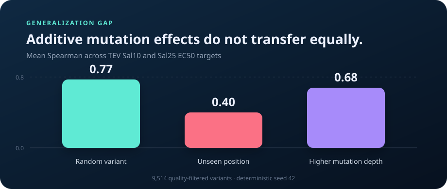

# VariantShift

**When does a protein mutation predictor actually generalize?**

VariantShift is a leakage-aware benchmark for protein variant-effect models. It compares
ordinary random splits with biologically harder tests: unseen residue positions, increased
mutational depth, and transfer between experimental conditions.

The initial case study uses the Align Foundation's TEV protease GROQ-seq release: 18,486
variants measured across 24 conditions at NIST's Living Measurement Systems Foundry.

## Research questions

1. How much does random splitting overstate performance?
2. Which models retain rank accuracy at residue positions absent from training?
3. Do single-mutant models transfer to combinatorial variants?
4. Is model confidence calibrated when the biological distribution shifts?

## Result

On 9,514 quality-filtered substitution variants, the additive baseline reaches **0.77 mean
Spearman** under a random variant split but only **0.40** when every test residue position is
absent from training. Its nominal 80% conformal interval coverage also falls from **81% to
63%** under the position shift.



The result is the point of the project: preventing exact-variant overlap is not enough. A model
can interpolate mutations at residue positions it has already observed and still fail to
generalize to unmeasured regions of the protein.

| Model | Random variant | Unseen position | Higher mutation depth |
| --- | ---: | ---: | ---: |
| Biophysical ridge | 0.58 | 0.39 | 0.43 |
| Additive ridge | **0.77** | **0.40** | **0.68** |

Values are mean Spearman correlations across the Sal10 and Sal25 EC50 targets. Full aggregate
results are in [`results/benchmark.csv`](results/benchmark.csv).

## Quick start

```bash
python -m venv .venv
source .venv/bin/activate
pip install -e '.[dev]'

variantshift download data/raw --accept-data-use-agreement
variantshift inspect data/raw/TEV_Pilot_SSVL_EP_output_v1.1.csv
variantshift benchmark data/raw/TEV_Pilot_SSVL_EP_output_v1.1.csv
variantshift report artifacts/benchmark.csv --filtered-rows 9514
```

Every command is deterministic at the default seed. Raw data and per-variant predictions stay
outside version control.

## Evaluation regimes

- **Random variant:** identical mutation strings are grouped so no exact variant crosses the
  train/test boundary. Residue positions may still overlap.
- **Unseen position:** complete residue positions are held out. Variants spanning both train
  and test positions are excluded, producing zero residue overlap.
- **Higher mutation depth:** training is restricted to single substitutions and testing uses
  variants containing two to five substitutions.

Each training set is further divided into fit and calibration subsets. Reported uncertainty is
an 80% split-conformal interval; its coverage is measured independently on every shifted test
set. See the complete [`docs/METHODS.md`](docs/METHODS.md) for cohort construction, feature
definitions, split invariants, and uncertainty methodology.

## Baselines

- `mean`: a no-information control.
- `biophysical_ridge`: mutation count, position, hydropathy, side-chain volume, charge,
  polarity, aromaticity, glycine, and proline deltas.
- `additive_ridge`: biochemical features plus sparse residue-position, substitution-class, and
  exact-mutation effects.

The baselines are intentionally interpretable. Protein language model comparisons belong in a
separate experiment because model pretraining can introduce sequence-level leakage that this
benchmark must document explicitly.

## Data

VariantShift never vendors the source measurements. Downloading the dataset requires
explicitly accepting the provider's data-use agreement.

Dataset: [TEV Protease — Pilot SSVL and epPCR Libraries](https://data.alignbio.org/groqseq/groqseq-014/)

The published release contains 18,486 rows and 151 columns. The default analysis removes indels,
nonsense mutations, and variants with fewer than 1,000 total barcode reads, leaving 9,514 rows.

## Repository structure

```text
src/variantshift/
  data.py          # download gate, schema validation, quality filtering
  mutations.py     # mutation parser and reference-sequence checks
  features.py      # biochemical and sparse additive encoders
  splits.py        # split construction and leakage audits
  models.py        # transparent supervised baselines
  metrics.py       # ranking, error, and conformal coverage
  evaluate.py      # benchmark orchestration
  report.py        # standalone HTML result report
tests/             # unit and invariant tests
results/           # aggregate, reproducible benchmark outputs
```

## Limitations

- The first result covers two fitted EC50 endpoints, not every raw assay condition.
- Position holdout measures extrapolation within one protein, not transfer to new protein
  families.
- Conformal coverage is guaranteed only under exchangeability; its breakdown under shift is a
  diagnostic, not a surprising violation of the method.
- Aggregate performance does not establish that a model is ready to prioritize wet-lab
  experiments.

## License

Code is released under the MIT License. The TEV dataset has separate terms from its provider.
