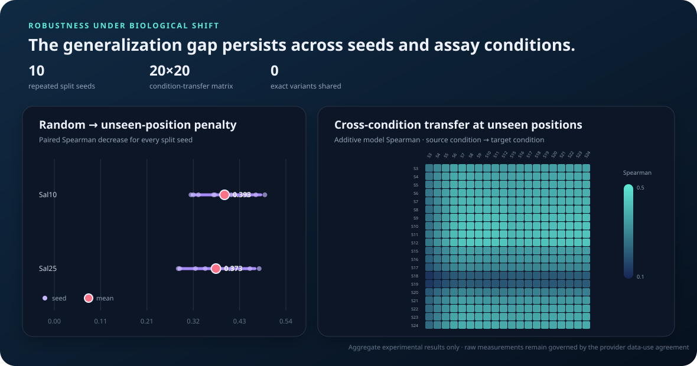

# VariantShift

**When does a protein mutation predictor actually generalize?**

VariantShift is a leakage-aware benchmark for protein variant-effect models. It compares
ordinary random splits with biologically harder tests: unseen residue positions, increased
mutational depth, and transfer between experimental conditions.

The initial case study uses the Align Foundation's TEV protease GROQ-seq release: 18,486
variants measured across 24 conditions at NIST's Living Measurement Systems Foundry.

## Research questions

1. How much does random splitting overstate performance?
2. Which models retain rank accuracy at residue positions absent from training?
3. Do single-mutant models transfer to combinatorial variants?
4. Is model confidence calibrated when the biological distribution shifts?

## Main result

On 9,514 quality-filtered variants, the additive baseline loses **0.393 Spearman on Sal10**
and **0.373 on Sal25** when every test residue position is absent from training. These are
means across 10 complete benchmark repetitions (seeds 42–51), not a single favorable split.
Nominal 80% conformal coverage falls by **14.0** and **21.3 percentage points** respectively.



The result is the point of the project: preventing exact-variant overlap is not enough. A model
can interpolate mutations at residue positions it has already observed and still fail to
generalize to unmeasured regions of the protein.

| Target | Random Spearman | Unseen-position Spearman | Paired gap | 80% coverage shift |
| --- | ---: | ---: | ---: | ---: |
| Sal10 EC50 | 0.795 | 0.401 | **0.393** | 79.5% → 65.5% |
| Sal25 EC50 | 0.763 | 0.389 | **0.373** | 79.9% → 58.5% |

The paired gap remained positive in all 20 target/seed comparisons. Full seed-level and
aggregate results are in [`results/robustness/`](results/robustness/).

## Condition transfer

VariantShift also trains on each of the 20 measured assay conditions and evaluates the resulting
ranking against all 20 target conditions. This produces a complete 20×20 transfer matrix under
both random-variant and unseen-position splits: **800 source/target evaluations** with zero exact
variant overlap.

At unseen positions, mean in-condition Spearman is 0.345 and mean cross-condition Spearman is
0.340. Average transfer is stable, but the worst source/target pair falls to 0.132 and the largest
pair-specific transfer gap is 0.167. That distinction matters: condition shift is not uniformly
damaging, while residue-position novelty produces a large, persistent penalty.

The full matrix and summary are in [`results/transfer/`](results/transfer/).

## Quick start

```bash
python -m venv .venv
source .venv/bin/activate
pip install -e '.[dev]'

variantshift download data/raw --accept-data-use-agreement
variantshift inspect data/raw/TEV_Pilot_SSVL_EP_output_v1.1.csv
variantshift benchmark data/raw/TEV_Pilot_SSVL_EP_output_v1.1.csv
variantshift report artifacts/benchmark.csv --filtered-rows 9514
variantshift robustness data/raw/TEV_Pilot_SSVL_EP_output_v1.1.csv
variantshift condition-transfer data/raw/TEV_Pilot_SSVL_EP_output_v1.1.csv
```

Every command is deterministic at the default seed. Raw data and per-variant predictions stay
outside version control.

## Evaluation regimes

- **Random variant:** identical mutation strings are grouped so no exact variant crosses the
  train/test boundary. Residue positions may still overlap.
- **Unseen position:** complete residue positions are held out. Variants spanning both train
  and test positions are excluded, producing zero residue overlap.
- **Higher mutation depth:** training is restricted to single substitutions and testing uses
  variants containing two to five substitutions.

Each training set is further divided into fit and calibration subsets. Reported uncertainty is
an 80% split-conformal interval; its coverage is measured independently on every shifted test
set. See the complete [`docs/METHODS.md`](docs/METHODS.md) for cohort construction, feature
definitions, split invariants, and uncertainty methodology.

The repeated benchmark uses consecutive seeds 42–51 and pairs random-versus-position results
within each seed. Seed ranges measure split sensitivity; they are not treated as independent
biological replicates or confidence intervals.

## Baselines

- `mean`: a no-information control.
- `biophysical_ridge`: mutation count, position, hydropathy, side-chain volume, charge,
  polarity, aromaticity, glycine, and proline deltas.
- `additive_ridge`: biochemical features plus sparse residue-position, substitution-class, and
  exact-mutation effects.

The baselines are intentionally interpretable. Protein language model comparisons belong in a
separate experiment because model pretraining can introduce sequence-level leakage that this
benchmark must document explicitly.

An optional ESM-2 8M scorer is included for that next experiment. It computes fast wild-type
marginal log odds in one forward pass and labels the strategy explicitly; it is not mixed into
the reported supervised table until its scores and pretraining assumptions are audited.

```bash
pip install -e '.[plm]'
variantshift esm-score data/raw/TEV_Pilot_SSVL_EP_output_v1.1.csv
```

## Data

VariantShift never vendors the source measurements. Downloading the dataset requires
explicitly accepting the provider's data-use agreement.

Dataset: [TEV Protease — Pilot SSVL and epPCR Libraries](https://data.alignbio.org/groqseq/groqseq-014/)

The published release contains 18,486 rows and 151 columns. The default analysis removes indels,
nonsense mutations, and variants with fewer than 1,000 total barcode reads, leaving 9,514 rows.

## Repository structure

```text
src/variantshift/
  data.py          # download gate, schema validation, quality filtering
  mutations.py     # mutation parser and reference-sequence checks
  features.py      # biochemical and sparse additive encoders
  splits.py        # split construction and leakage audits
  models.py        # transparent supervised baselines
  metrics.py       # ranking, error, and conformal coverage
  evaluate.py      # benchmark orchestration
  robustness.py    # repeated splits and paired generalization gaps
  transfer.py      # source-to-target assay-condition transfer
  provenance.py    # data/source/artifact integrity manifests
  visualize.py     # dependency-free shift-analysis SVG
  report.py        # standalone HTML result report
tests/             # unit and invariant tests
results/           # aggregate, reproducible benchmark outputs
```

## Result integrity

[`results/run-manifest.json`](results/run-manifest.json) binds the dataset SHA-256, source commit,
filter and evaluation configuration, dependency versions, and ten committed artifacts. CI verifies
every artifact byte-for-byte without requiring the licensed raw measurements:

```bash
variantshift verify-artifacts results/run-manifest.json
```

When the dataset is available locally, the same command verifies its hash as well.

## Limitations

- The first result covers two fitted EC50 endpoints, not every raw assay condition.
- Position holdout measures extrapolation within one protein, not transfer to new protein
  families.
- Repeated seeds characterize split sensitivity on this cohort rather than uncertainty across
  proteins, assays, or biological replicates.
- Conformal coverage is guaranteed only under exchangeability; its breakdown under shift is a
  diagnostic, not a surprising violation of the method.
- Aggregate performance does not establish that a model is ready to prioritize wet-lab
  experiments.

## License

Code is released under the MIT License. The TEV dataset has separate terms from its provider.
