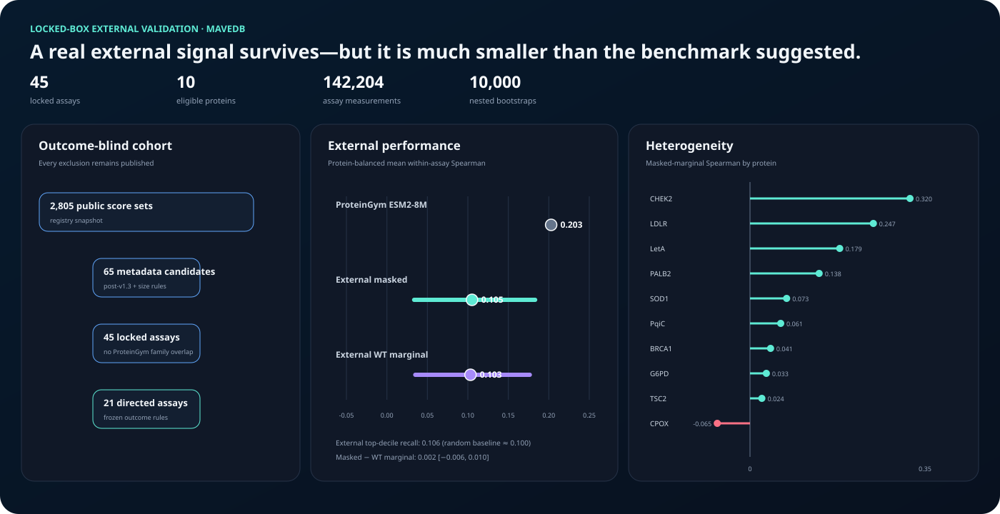

# Locked-box validation on post-ProteinGym MaveDB assays

## Result in one sentence

ESM-2 8M masked-marginal scores retained a positive protein-balanced association on a temporally
external, family-filtered MaveDB cohort (mean within-assay Spearman 0.105; nested-bootstrap 95%
interval 0.034–0.183), but ranking quality was about half the descriptive ProteinGym estimate and
top-decile recovery was essentially random (0.106 versus 0.100).

## Why this is a locked-box test

The panel, models, scoring rules, outcome filters, estimands, uncertainty procedure, and success
criterion were frozen in commit `4d1f98ec5c82de7d322aab68c35076d713467501` at 16:17 UTC on
August 29, 2026. The protocol declared `outcomes_accessed: false` and was pushed before any selected
MaveDB score endpoint was requested. All 45 score tables were first accessed afterward, at one
recorded timestamp. Their byte counts and SHA-256 hashes are published in the input ledger.

This boundary prevents choosing the panel or primary analysis after seeing its scores. It does not
make the study prospective in the experimental sense: the underlying measurements had already been
generated by other groups.

## Outcome-blind cohort construction

The registry search included every public MaveDB score set published after the ProteinGym v1.3
release on April 28, 2025 and no later than August 29, 2026. Metadata filters required at least 500
declared variants, exactly one protein target, a 40–2,000-residue target sequence, and standard amino
acids. An exhaustive MMseqs2 search then excluded any target with at least 30% identity and at least
80% bidirectional coverage to a ProteinGym target.

| Stage | Assays |
| --- | ---: |
| Public MaveDB registry | 2,805 |
| Passed metadata rules | 65 |
| Excluded for ProteinGym family overlap | 20 |
| Locked before score access | 45 |
| Passed frozen direction and outcome rules | 21 |

The 21 directed assays contain 142,204 retained single-missense measurements at 4,956 mutated
positions. They represent 10 biological proteins and 13 target sequences. Twenty-three locked assays
were excluded because score direction was neither predeclared in MaveDB calibration metadata nor
identifiable from the required synonymous and termination controls. One additional assay had only
two unique outcome values. Every decision, including all exclusions, remains in `assay-audit.csv`.

## Frozen prediction and evaluation

The primary model was `esm2_t6_8M_UR50D` with masked-marginal log-odds. Wild-type marginal log-odds
from the same checkpoint were secondary. Sequences longer than the model context used deterministic
1,022-residue windows with 256-residue overlap; each position was assigned to the window that placed
it furthest from a boundary. The run scored 78,982 unique sequence–substitution pairs once and reused
them across repeated assay conditions.

The primary estimand first averages within-assay Spearman correlations across assays for the same
protein, then averages proteins. Its 95% interval uses 10,000 nested resamples of mutated positions,
assays within proteins, and proteins. Both scoring strategies use identical draws, making their
difference interval paired. The preregistered success rule was a primary lower confidence bound above
zero.

## External results

| Scoring strategy | Mean Spearman | 95% interval | Top-decile recall | Selection gain (assay SD) |
| --- | ---: | ---: | ---: | ---: |
| Masked marginal | **0.105** | **0.034–0.183** | 0.106 | 0.078 |
| Wild-type marginal | 0.103 | 0.035–0.177 | 0.108 | 0.072 |

The masked-marginal analysis met the preregistered statistical success rule. The masked-minus-
wild-type difference was only 0.0019 (paired 95% interval −0.0057 to 0.0100), so the data do not
resolve an advantage for either scoring rule.

The external estimate is 51.8% of the ProteinGym v1.3 ESM-2 8M protein-balanced estimate of 0.203.
That comparison is descriptive rather than a causal or paired dataset effect because assay mix,
measurement technologies, and publication periods differ. It nevertheless shows that the stronger
benchmark number does not transport intact to the frozen external panel.

The ranking signal also does not yet translate into useful variant selection. A top-decile recall of
0.106 is only 0.006 above the random baseline, average selected-variant enrichment is 0.078 assay
standard deviations, and best-variant regret is 0.968 standard deviations. These secondary results
are more decision-relevant than the positive correlation test and materially temper it.

## Heterogeneity

Masked-marginal protein-level Spearman ranged from 0.320 on CHEK2 to −0.065 on CPOX. LDLR (0.247),
LetA (0.179), and PALB2 (0.138) showed the next-largest associations; six of ten proteins were below
0.10. The broad interval around the aggregate therefore reflects genuine target heterogeneity, not
only sampling error. A single global average is not evidence that this model is reliable for an
unseen individual protein.

## Implementation parity audit

The local scorer was checked against the official ProteinGym ESM-2 8M column on 621 substitutions
across 35 positions in `TCRG1_MOUSE_Tsuboyama_2023_1E0L`. Spearman was 1.000000, Pearson exceeded
0.9999999999, and maximum absolute score difference was 0.0000163. This makes a scoring
implementation discrepancy an implausible explanation for the external performance drop.

The executed checkpoint contained 30,099,493 bytes and had SHA-256
`46f002a9870c9bdecd0ea887acb1f9a38a6b561e8f8bf8a6990b679b9d31b928`. The model audit publishes
the device, library versions, sequence hashes, windows, positions, and variant counts.

## What the result establishes

- A small ESM-2 8M ranking signal survives temporal and target-family separation from ProteinGym.
- The predeclared positive-correlation test succeeds, but its effect is substantially smaller than
  the benchmark estimate.
- Masked-marginal scoring does not show a resolved advantage over the cheaper wild-type marginal
  strategy on this cohort.
- Positive average correlation is insufficient evidence for reliable top-variant selection.
- Outcome-blind exclusions, input hashes, scoring parity, nested uncertainty, and target-level
  heterogeneity are all independently auditable.

## What it still does not establish

This is an external retrospective validation, not a prospective biological experiment. It does not
show enrichment among variants selected before a new assay, replication by an independent lab,
mechanistic causality, clinical validity, or utility across all protein families. The direction rule
also excluded over half the locked assays from the directed primary analysis; publishing those
exclusions prevents silent attrition but cannot recover their missing orientation metadata.

The irreducible next step is to freeze proteins and candidate variants that have not yet been
measured, generate the measurements afterward—preferably in an independent laboratory—and test
selection enrichment and calibration without modifying the frozen analysis. Code can design and
audit that experiment; code cannot substitute for the new measurements.

## Reproducibility map

- Frozen protocol: [`../protocols/mavedb-external-v1/`](../protocols/mavedb-external-v1/)
- Public outcome and exclusion audit: [`../results/mavedb-external-v1/assay-audit.csv`](../results/mavedb-external-v1/assay-audit.csv)
- Aggregate estimates: [`../results/mavedb-external-v1/bootstrap-summary.csv`](../results/mavedb-external-v1/bootstrap-summary.csv)
- Target-level estimates: [`../results/mavedb-external-v1/protein-metrics.csv`](../results/mavedb-external-v1/protein-metrics.csv)
- Model execution audit: [`../results/mavedb-external-v1/model-audit.csv`](../results/mavedb-external-v1/model-audit.csv)
- Artifact manifest: [`../results/mavedb-external-v1/run-manifest.json`](../results/mavedb-external-v1/run-manifest.json)

