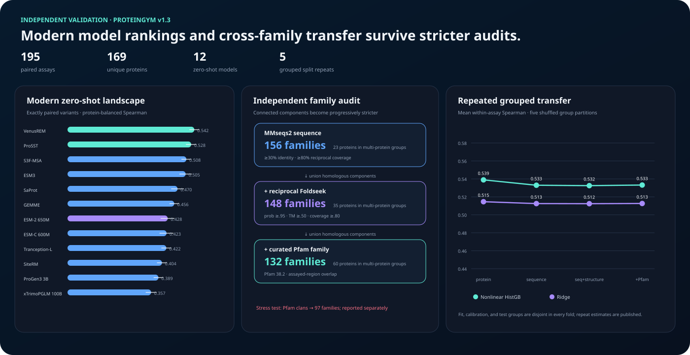

# Methods and results

VariantShift tests whether protein variant-effect predictors generalize when the biological
setting changes. It combines TEV protease measurements, ProteinGym assays, and an external
MaveDB evaluation.

## Evaluation approach

- Compare random-variant splits with tests on unseen residue positions, proteins, and families.
- Evaluate simple supervised baselines alongside pretrained scores and published supervised models.
- Measure ranking quality, uncertainty coverage, and the usefulness of selecting high-value variants.
- Test whether a model-selection policy can choose a predictor or abstain on unfamiliar tasks.
- Keep exploratory development results separate from confirmation claims.

Spearman correlation measures how well predicted and measured rankings agree. A held-out
position, protein, or family is excluded from model training, making the test closer to a new
biological setting. Exact cohort rules and statistical procedures are linked in the
[research records](RESEARCH_RECORDS.md).

## Results

### Familiar positions overstate baseline performance

On 9,514 quality-filtered TEV variants, the additive baseline loses roughly 0.38 Spearman
correlation when test residue positions are absent from training. These are means across ten
paired benchmark repetitions.

| TEV endpoint | Random variants | Unseen positions | Spearman gap |
| --- | ---: | ---: | ---: |
| Sal10 EC50 | 0.795 | 0.401 | 0.393 |
| Sal25 EC50 | 0.763 | 0.389 | 0.373 |

Nominal 80% conformal coverage falls by 14.0 and 21.3 percentage points, respectively.
The performance gap is positive in all twenty endpoint–seed comparisons.

### The baseline gap extends across proteins

Of 217 ProteinGym assays, 195 across 169 proteins pass the eligibility audit, providing
689,994 single-substitution measurements. The additive baseline's protein-balanced mean
Spearman falls from **0.617 to 0.351** under unseen-position evaluation. The paired gap is
**0.266**, with a protein-bootstrap 95% interval of **0.246–0.287**.

Strong supervised models retain more performance under structured splits:

| Official supervised model | Random | Modulo position | Contiguous position |
| --- | ---: | ---: | ---: |
| ESM-1v embedding probe | 0.667 | 0.549 | 0.507 |
| ProteinNPT | 0.776 | 0.630 | 0.584 |
| Kermut | 0.785 | 0.672 | 0.633 |

The simple baseline's failure therefore does not establish that supervised models generally
underperform pretrained scores. A separate matched comparison of twelve pretrained score sets
finds VenusREM highest at **0.542** protein-balanced mean Spearman, followed by ProSST at
**0.528** and S3F-MSA at **0.508**.

### Family holdouts clarify the source of transfer

A pooled nonlinear model reaches mean within-assay Spearman of **0.539** on held-out proteins
and **0.533** on held-out curated Pfam families. Removing fixed ESM score features reduces
the family-held-out result to **0.360**. Much of the transfer performance comes from
pretrained score information, rather than learning from assay labels alone.

### External validation shows weaker signal

The completed MaveDB external evaluation includes **21 assays, 142,204 measurements, and
10 proteins**. ESM-2 8M reaches mean Spearman of **0.105** (nested-bootstrap 95% interval
**0.034–0.183**). Top-decile recall is **0.106**, close to the random baseline of **0.100**.
Positive ranking signal transfers, but these results do not demonstrate useful top-variant
selection.

### Selective deployment remains a development result

An initial model selector fails its external development pilot against always using VespaG.
The revised **Conservative Auditor v2** chooses VespaG or abstains. It improves the
regret–coverage metric by **0.0230** in the family-held-out development screen (95% interval
**0.0067–0.0425**), but fails leave-one-panel-out transport.

Ten model configurations spanning six model/input families pass execution qualification on
**413 shared Domainome targets**. Qualification establishes coverage and reproducibility of
the execution machinery; confirmation outcomes remain sealed, so it does not establish
the policy's scientific utility.

### A predictor-span pilot finds assay-specific information

An exploratory study of **95 published predictors**, **22 assays**, and **11 paired proteins**
tests whether a position-held-out linear combination recovers signal beyond selecting one
predictor. Mean Spearman improves from **0.5097 to 0.5938**; the paired improvement is
**0.0840** (protein-pair bootstrap 95% interval **0.0662–0.1058**).

The improvement is positive on all 22 development assays. This supports further investigation
of phenotype-specific readouts; it does not establish a representational ceiling or a
validated deployment method.

## Interpretation and scope

VariantShift shows that evaluation design can change both measured performance and the
conclusions drawn from model rankings. Exact-variant separation alone does not prevent
position leakage, and good average ranking performance does not guarantee calibrated
uncertainty or useful variant selection under distribution shift.

These are computational studies using existing measurements. Pretrained models may have
seen related biological sequences, repeated split seeds are not independent biological
replicates, and retrospective benchmark performance does not establish prospective
experimental benefit.

## Further reading

See the [research records](RESEARCH_RECORDS.md) for detailed methods, study reports, and reproducibility artifacts.
